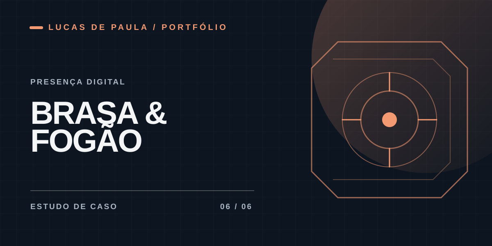

# Brasa e Fogão

**Presença digital para restaurante**

## Contexto

O projeto foi pensado para facilitar a descoberta do restaurante e o acesso a seus canais digitais em uma experiência simples para celular.

## Minha participação

Participei da organização do conteúdo e da presença visual do biosite. O material público aqui apresenta a proposta, sem publicar arquivos internos do cliente.

## O que foi trabalhado

- Estrutura de navegação curta para acesso aos principais canais.
- Apresentação visual adaptada a telas pequenas.

Este estudo de caso está resumido até que haja capturas autorizadas e uma descrição mais completa das entregas.

[← Todos os projetos](../README.md)
