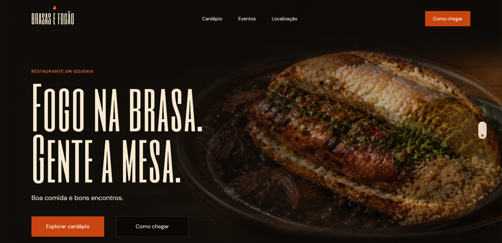

# Brasa e Fogão

**Presença digital para restaurante**

[Acessar o site do restaurante](https://brasasefogao.com.br/). A capa apresenta esse site principal; o biosite de links descrito abaixo é uma frente separada do projeto.

## Contexto

O site principal já está publicado. O biosite de links foi pensado para facilitar a descoberta do restaurante e o acesso a seus canais digitais em uma experiência simples para celular.

## Minha participação

Participei da organização do conteúdo e da presença visual do biosite.

## O que foi trabalhado

- Estrutura de navegação curta para acesso aos principais canais.
- Apresentação visual adaptada a telas pequenas.

**Stack do biosite local:** React, TypeScript, TanStack Start, Tailwind CSS e Vite.

Este estudo de caso está resumido até que haja capturas da interface do próprio biosite e uma descrição mais completa das entregas.

[← Todos os projetos](../README.md)
