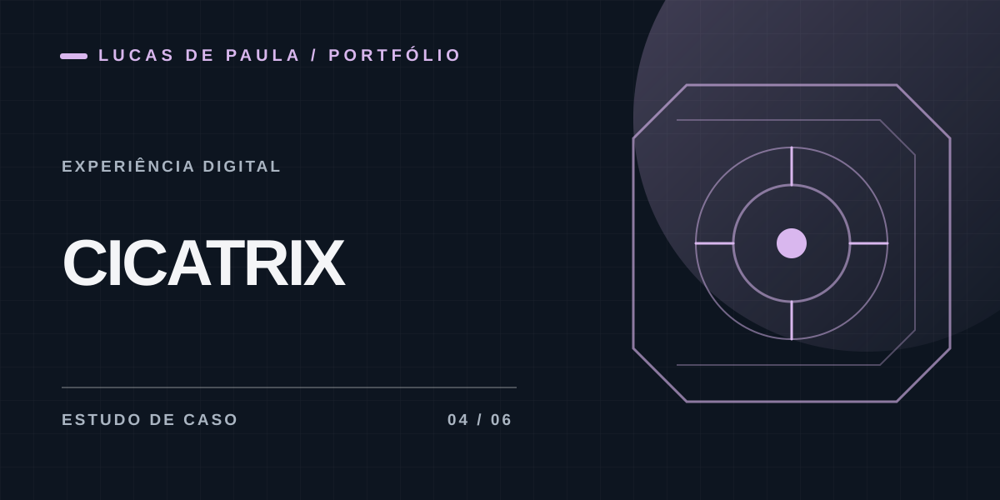

# Cicatrix

**Protótipo de experiência digital para cuidados de cicatrizes**

## Contexto

A Cicatrix apresenta protocolos de tratamento e acompanhamento de cicatrizes no pós-operatório. O produto não oferece cirurgia nem promete um resultado clínico específico.

## Minha participação

Participei da definição da jornada, dos textos e das iterações da landing page e do formulário, buscando clareza para o paciente e uma interface responsiva.

## O que foi trabalhado

- Landing page com apresentação dos protocolos e tecnologias.
- Formulário em etapas com validações e regras de preço demonstrativas.
- Ajustes de acessibilidade, versão mobile e refinamento visual.

**Tecnologias do protótipo:** HTML, CSS e JavaScript.

A versão documentada aqui é um **protótipo de frontend**. Pagamentos, faturamento e painel de vendas são possibilidades de evolução e não são apresentados como funcionalidades prontas.

[← Todos os projetos](../README.md)
