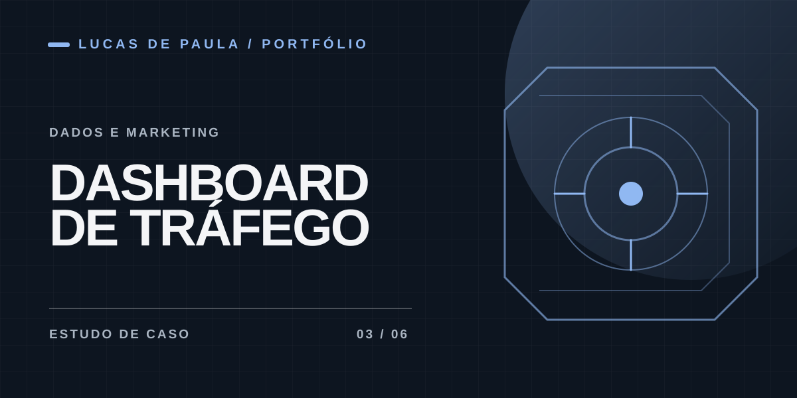

# Dashboard de Tráfego

**Plataforma para organizar clientes, contas de anúncios e relatórios**

## Contexto

O projeto busca reunir a operação de marketing em um espaço com clientes, contas, integrações, acompanhamento e relatórios.

## Minha participação

Participei da definição e evolução dos fluxos de cadastro, suporte e uso da plataforma. As mudanças foram orientadas por dificuldades reais de configuração e navegação, com implementação apoiada por IA.

## O que foi trabalhado

- Organização de contas ou workspaces, planos e clientes.
- Fluxos de configuração de contas Meta Ads e de módulos adicionais.
- Visões de anúncios, gastos, relatórios e monitoramento por cliente.
- Área de suporte administrativo e orientação de primeiros passos.

**Tecnologias identificadas no histórico do projeto:** Laravel, PHP e integrações com serviços de marketing. A disponibilidade de cada conexão externa depende da configuração e do ambiente.

O produto segue em evolução. Não publico código, tokens de API ou dados de campanhas e clientes.

[← Todos os projetos](../README.md)
