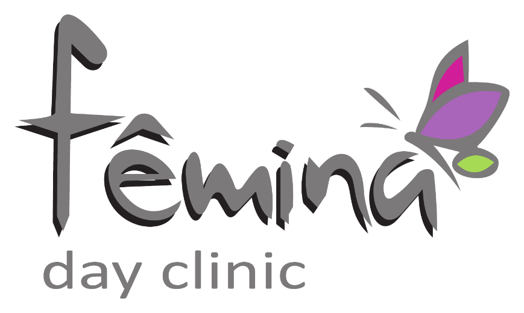

# Fêmina Internação

**MVP de pré-internação hospitalar e automação administrativa**

O sistema de internação está em testes. A apresentação pública usa apenas a logo, sem imagens de pacientes ou telas internas.

## Contexto

A pré-internação reúne informações clínicas e administrativas que precisam ser preenchidas corretamente e encaminhadas à equipe antes do atendimento.

## Minha participação

Participei da construção e da evolução dos fluxos de pré-internação e do painel de apoio à equipe, usando IA como ferramenta de desenvolvimento e validando ajustes a partir de situações reais de uso.

## O que foi trabalhado

- Formulário multietapas com validações, campos condicionais, máscaras e revisão antes do envio.
- Consulta de endereço pelo ViaCEP e preenchimento de dados relacionados.
- Componente de busca de médicos com seleção por teclado ou toque e preenchimento do CRM.
- Geração de documentos, integração de assinatura eletrônica e acompanhamento no painel.
- Organização de dados legados para a evolução do Fêmina Hub Cirúrgico.

**Tecnologias identificadas no MVP:** PHP, MySQL/MariaDB, SQL/PDO, HTML, CSS, JavaScript, mPDF e APIs HTTP/GraphQL.

A evolução do Hub foi trabalhada em ambiente de homologação. Este estudo de caso não apresenta a plataforma inteira como validada em produção. O código e os dados de pacientes permanecem privados.

[← Todos os projetos](../README.md)
